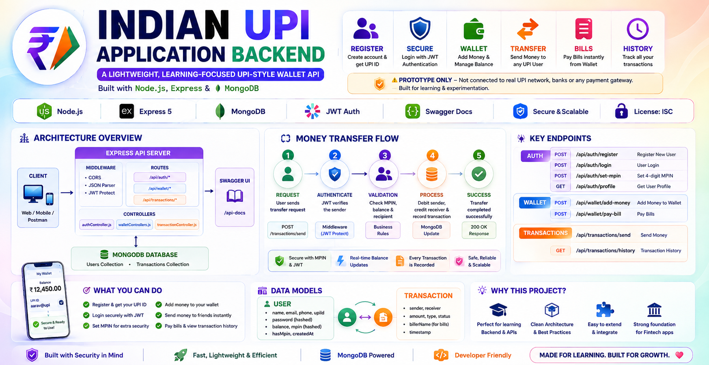
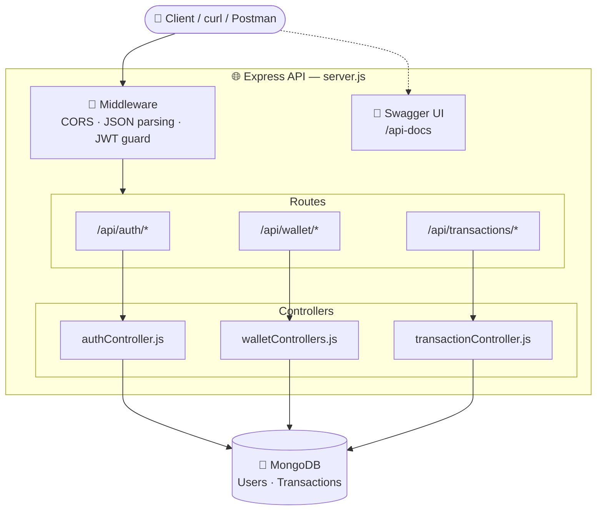
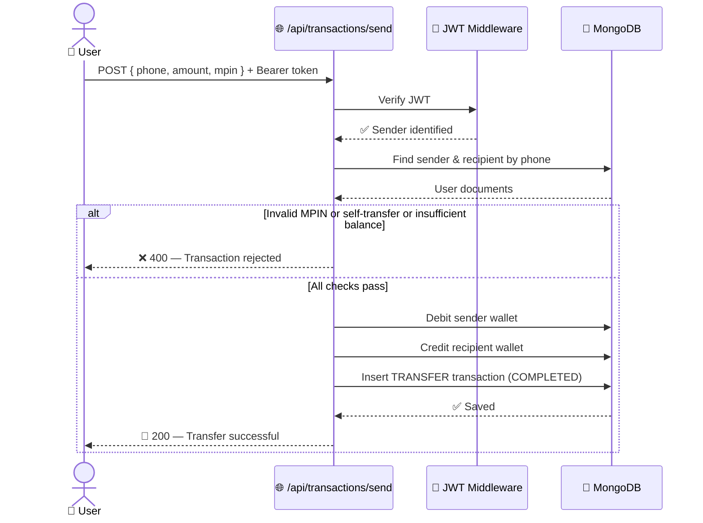
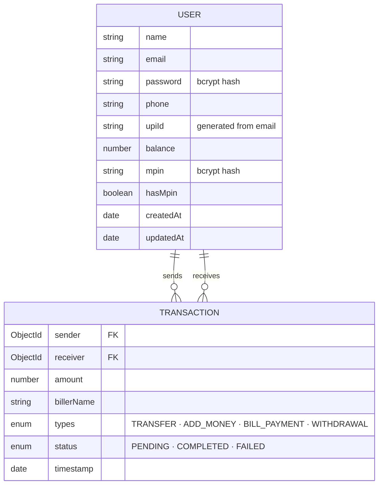

<div align="center">

# 💸 Indian UPI Application Backend

### A lightweight, learning-focused UPI-style wallet API — built with Node.js, Express & MongoDB

[](https://nodejs.org/)
[](https://expressjs.com/)
[](https://www.mongodb.com/)
[](https://jwt.io/)
[](http://localhost:5000/api-docs)
[](#-license)

**A UPI-inspired wallet backend — register, log in, set an MPIN, fund your wallet, send money peer-to-peer, and pay bills, all through a clean REST API.**

> ⚠️ **Prototype only.** This does *not* connect to the real UPI network, banks, or any payment gateway. Built for learning & experimentation.

</div>

---


## 📚 Table of Contents

- [✨ Features](#-features)
- [🏗️ Architecture](#️-architecture)
- [🔁 Money Transfer Flow](#-money-transfer-flow)
- [🧰 Tech Stack](#-tech-stack)
- [⚙️ Prerequisites](#️-prerequisites)
- [🚀 Installation](#-installation)
- [🔐 Environment Configuration](#-environment-configuration)
- [▶️ Running the Application](#️-running-the-application)
- [🔑 Authentication](#-authentication)
- [📡 API Reference](#-api-reference)
- [🗃️ Data Models](#️-data-models)
- [📁 Project Structure](#-project-structure)
- [📜 Available Scripts](#-available-scripts)
- [🛡️ Security & Production Notes](#️-security--production-notes)
- [🐞 Troubleshooting](#-troubleshooting)
- [📄 License](#-license)

---

## ✨ Features

| # | Capability | Description |
|---|---|---|
| 👤 | **User registration** | Creates a user with a unique email + phone number, and auto-generates a PhonePe-style UPI ID from the email. |
| 🔓 | **User login** | Verifies credentials and returns a signed JWT. |
| 🪪 | **Protected profile** | Returns the authenticated user's profile — password & MPIN hash never exposed. |
| 🔢 | **MPIN setup** | Stores a bcrypt-hashed 4-digit MPIN used to authorize transactions. |
| 💰 | **Wallet funding** | Adds funds to the wallet and logs an `ADD_MONEY` transaction. |
| 🔁 | **Peer-to-peer transfer** | Sends money to another user by phone number, gated behind MPIN verification. |
| 🧾 | **Bill payment** | Deducts from the wallet and logs a `BILL_PAYMENT` transaction. |
| 📜 | **Transaction history** | Lists every transaction where the user is sender or receiver. |
| 📘 | **API documentation** | Interactive Swagger UI served at `/api-docs`. |

---

## 🏗️ Architecture



---

## 🔁 Money Transfer Flow



---

## 🧰 Tech Stack

| Layer | Technology |
|---|---|
| 🖥️ Runtime | Node.js |
| 🌐 Web framework | Express 5 |
| 🍃 Database | MongoDB with Mongoose |
| 🔐 Authentication | JWT (`jsonwebtoken`) |
| 🔒 Hashing | `bcryptjs` (passwords & MPINs) |
| 📘 API docs | Swagger UI Express + Swagger Autogen |
| 🧩 Middleware | CORS, JSON body parsing, URL-encoded parsing, JWT protection |

---

## ⚙️ Prerequisites

- ✅ **Node.js** and npm
- ✅ A running **MongoDB** server (local or hosted)
- ✅ **Git** (for cloning)

The project uses the **CommonJS** module system, with `server.js` as its application entry point.

---

## 🚀 Installation

```bash
git clone https://github.com/paras160500/Indian-UPI-Application-Backend.git
cd Indian-UPI-Application-Backend
npm install
```

---

## 🔐 Environment Configuration

Create your local `.env` from the provided template:

```bash
cp .env.sample .env
```

```env
PORT=5000
JWT_SECRET=replace-this-with-a-long-random-secret
MONGO_URI=mongodb://localhost:27017/upi_application_dev
```

| Variable | Required | Purpose | Example |
|---|:---:|---|---|
| `PORT` | ❌ | Port the Express server listens on (defaults to `5000`) | `5000` |
| `JWT_SECRET` | ✅ | Secret used to sign & verify auth tokens | `replace-with-a-secure-secret` |
| `MONGO_URI` | ✅ | MongoDB connection string used by Mongoose | `mongodb://localhost:27017/upi_application_dev` |

> 🚫 Never commit real credentials or production secrets — keep `.env` out of version control.

---

## ▶️ Running the Application

**Production mode:**
```bash
npm start
```

**Development mode** (auto-restarts on change via Nodemon):
```bash
npm run dev
```

Once running, the API is live at:

```
http://localhost:5000
```

**Health check:**
```bash
curl http://localhost:5000/
```

📘 Interactive Swagger docs: **http://localhost:5000/api-docs**

---

## 🔑 Authentication

Registration and login return a JWT. Attach it to protected requests:

```
Authorization: Bearer <your-jwt-token>
```

⏳ Tokens expire after **30 days**. Protected routes use the JWT to resolve the current user before handing off to the controller.

---

## 📡 API Reference

All paths below are relative to `http://localhost:5000`.

### 🔐 Authentication Routes

| Method | Endpoint | Auth | Body |
|---|---|:---:|---|
| `POST` | `/api/auth/register` | 🌍 Public | `name`, `email`, `phone`, `password` |
| `POST` | `/api/auth/login` | 🌍 Public | `email`, `password` |
| `POST` | `/api/auth/set-mpin` | 🔒 Bearer | `mpin` — exactly 4 characters |
| `GET` | `/api/auth/profile` | 🔒 Bearer | — |

<details>
<summary>📥 <b>Register a user</b></summary>

```bash
curl -X POST http://localhost:5000/api/auth/register \
  -H "Content-Type: application/json" \
  -d '{
    "name": "Aarav Sharma",
    "email": "aarav@example.com",
    "phone": "9876543210",
    "password": "secure-password"
  }'
```
</details>

<details>
<summary>🔓 <b>Log in</b></summary>

```bash
curl -X POST http://localhost:5000/api/auth/login \
  -H "Content-Type: application/json" \
  -d '{
    "email": "aarav@example.com",
    "password": "secure-password"
  }'
```
</details>

<details>
<summary>🔢 <b>Set an MPIN</b></summary>

```bash
curl -X POST http://localhost:5000/api/auth/set-mpin \
  -H "Content-Type: application/json" \
  -H "Authorization: Bearer <your-jwt-token>" \
  -d '{
    "mpin": "1234"
  }'
```
</details>

<details>
<summary>🪪 <b>Get authenticated profile</b></summary>

```bash
curl http://localhost:5000/api/auth/profile \
  -H "Authorization: Bearer <your-jwt-token>"
```
</details>

### 🔁 Transaction Routes

| Method | Endpoint | Auth | Body |
|---|---|:---:|---|
| `POST` | `/api/transactions/send` | 🔒 Bearer | `phone`, `amount`, `mpin` |
| `GET` | `/api/transactions/history` | 🔒 Bearer | — |

<details>
<summary>💸 <b>Send money</b></summary>

```bash
curl -X POST http://localhost:5000/api/transactions/send \
  -H "Content-Type: application/json" \
  -H "Authorization: Bearer <your-jwt-token>" \
  -d '{
    "phone": "9123456789",
    "amount": 250,
    "mpin": "1234"
  }'
```

The transfer logic validates the sender, MPIN, recipient phone number, self-transfer condition, and available balance before updating both wallets and recording a `COMPLETED` `TRANSFER` transaction.
</details>

<details>
<summary>📜 <b>Get transaction history</b></summary>

```bash
curl http://localhost:5000/api/transactions/history \
  -H "Authorization: Bearer <your-jwt-token>"
```
</details>

### 👛 Wallet Routes

| Method | Endpoint | Auth | Body |
|---|---|:---:|---|
| `POST` | `/api/wallet/add-money` | 🔒 Bearer | `amount` |
| `POST` | `/api/wallet/pay-bill` | 🔒 Bearer | `billerName`, `amount`, `mpin` |

<details>
<summary>💰 <b>Add money to wallet</b></summary>

```bash
curl -X POST http://localhost:5000/api/wallet/add-money \
  -H "Content-Type: application/json" \
  -H "Authorization: Bearer <your-jwt-token>" \
  -d '{
    "amount": 1000
  }'
```
</details>

<details>
<summary>🧾 <b>Pay a bill</b></summary>

```bash
curl -X POST http://localhost:5000/api/wallet/pay-bill \
  -H "Content-Type: application/json" \
  -H "Authorization: Bearer <your-jwt-token>" \
  -d '{
    "billerName": "Electricity Board",
    "amount": 450,
    "mpin": "1234"
  }'
```
</details>

---

## 🗃️ Data Models



### 👤 User

Stores identity, authentication, wallet, and MPIN state. Passwords and MPINs are always stored as **bcrypt hashes**, never plaintext.

| Field | Type | Notes |
|---|---|---|
| `name` | String | Required user name |
| `email` | String | Required & unique |
| `password` | String | Required bcrypt hash |
| `phone` | String | Required & unique — used for transfers |
| `upiId` | String | Generated from the email prefix |
| `balance` | Number | Defaults to `0` |
| `mpin` | String | Bcrypt hash of the MPIN |
| `hasMpin` | Boolean | Whether an MPIN has been configured |
| `createdAt` / `updatedAt` | Date | Auto-managed by Mongoose timestamps |

### 🔁 Transaction

| Field | Type | Notes |
|---|---|---|
| `sender` | ObjectId | Reference to a `User` document |
| `receiver` | ObjectId | Reference to a `User` document |
| `amount` | Number | Transaction amount |
| `billerName` | String | Used for bill payments |
| `types` | Enum | `TRANSFER`, `ADD_MONEY`, `BILL_PAYMENT`, `WITHDRAWAL` |
| `status` | Enum | `PENDING`, `COMPLETED`, `FAILED` |
| `timestamp` | Date | Defaults to current time |

---

## 📁 Project Structure

```
.
├── 📄 server.js                  # App entry point
├── 📦 package.json
├── 🔐 .env.sample
├── 📘 swagger-output.json
└── 📂 src
    ├── ⚙️  config
    │   └── db.js
    ├── 🎮 controllers
    │   ├── authController.js
    │   ├── transactionController.js
    │   └── walletControllers.js
    ├── 🧩 middlewares
    │   └── protect.js
    ├── 🗃️  model
    │   ├── Transaction.js
    │   └── User.js
    └── 🛣️  routes
        ├── authRoutes.js
        ├── transactionRoutes.js
        └── walletRoutes.js
```

The entry point loads environment variables, connects to MongoDB, registers Express middleware, mounts Swagger UI, and attaches the auth, transaction, and wallet route groups.

---

## 📜 Available Scripts

| Command | Purpose |
|---|---|
| `npm install` | 📦 Installs project dependencies |
| `npm start` | ▶️ Starts the Express server with Node.js |
| `npm run dev` | 🔄 Starts the server with Nodemon for development |
| `npm run swagger` | 📘 Regenerates Swagger documentation |
| `npm run seed` | 🌱 Runs the seed script if `seed.js` is available |

---

## 🛡️ Security & Production Notes

> This implementation is great for **experimentation and local development**, but it is **not production-ready**.

Before going anywhere near production, you'd need to:

- 🔑 Replace the sample JWT secret with a strong, rotated secret
- 🚫 Keep `.env` out of version control
- 🧼 Validate and sanitize all request input
- 🚦 Add rate limiting
- 🔒 Use HTTPS everywhere
- ⚛️ Wrap balance updates in database transactions for atomicity
- 🧾 Add audit logging and idempotency keys
- 🕵️ Implement fraud controls & concurrency protection
- 🗝️ Use a proper secret management system
- 🏦 Integrate a real payment provider

> ℹ️ The `add-money` endpoint currently **simulates** wallet funding — it does not charge any real bank account or payment instrument.

---

## 🐞 Troubleshooting

| Symptom | Fix |
|---|---|
| 🍃 Server starts but DB operations fail | Confirm MongoDB is running and `MONGO_URI` points to a reachable database |
| 🔒 Protected endpoints reject requests | Check the `Authorization` header uses exact `Bearer <token>` format, and that `JWT_SECRET` hasn't changed since the token was issued |
| 📘 API docs won't load | Confirm `swagger-output.json` exists in the project root and restart the server after config changes |

---

## 📄 License

Published under the **ISC License**, as declared in `package.json`.

<div align="center">

---

Made with ⚡ Node.js, 🍃 MongoDB, and a healthy respect for real payment infrastructure

</div>
